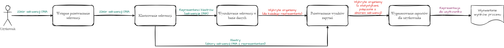

# Potok przetwarzania

## Informacje wstępne

Główny potok odpowiedzialny za przetwarzanie sekwencji DNA wraz z generowaniem
raportów dla użytkownika (na podstawie wyników przetwarzania).
Potok nie zawiera elementów związanych z interfejsem użytkownika, dostępem do
baza danych oraz dodatkowych narzędzi

## Elementy potoku

### 1. Wstępne przetwarzanie danych

Wejście: `Sekwencja DNA w formacie FASTA/FASTQ`

Wyjście: `Sekwencje DNA w formacie FASTA/FASTQ`

Pierwszym krokiem całego potoku jest wstępne przetwarzanie, które ma na celu
sprawdzenie czy dostarczone sekwencje DNA są prawidłowe tj. spełniają wymagania
ilości/jakości, długości sekwencj. Na wstępnym etapie możliwe jest wykrywanie
sekwencji identycznych

### 2. Klastrowanie sekwencji

Wejście: `Sekwencje DNA w formacie FASTA/FASTQ`

Wyjście: `Klastry [zbiór sekwencji DNA + reprezentant]`

Krok klastrowania polega na stworzeniu klastrów sekwencji DNA wraz z wybranymi
reprezentantami (sekwencjami, które najlepiej reprezentują dane klastry).
Głównym celeme tego kroku jest redukcja ilości przetwarzanych sekwencji do
niezbędnego minimum (zapewniającego zadowalające wyniki całego procesu)

### 3. Wyszukiwanie sekwencji w bazie danych

Wejście: `Sekwencje DNA`

Wyjście: `Lista wykrytych organizmów (per sekwencja)`

Wyszukiwanie sekwencji w bazie danych pozwala określić do jakich organizmów
wyszukiwana sekwencja należy. Na tym etapie przetwarzanie są jedynie
reprezentanci danych klastrów. W wyniku zapytań uzyskuje się dla każdego
reprezentanta listę organizmów

### 4. Przetwarzanie wyników zapytań

Wejście: `Lista wykrytych organizmów + Klastry`

Wyjście: `Wewnętrzna reprezentacja danych`

Etap łączy informacje o klastrach wraz z listami wykrytych organizmów. Krok ten
umożliwia powiązanie wykrytych organizmów z wejściowymi sekwencjami DNA /
klastrami. Dane przekazuje dalej jako wewnętrzną reprezentację, która zawiera
szczegółowe informacje - przydatne do generowania raportów

### 5. Generowanie raportów dla użytkownika

Wejście: `Wewnętrzna reprezentacja danych`

Wyjście: `Raporty dla użytkownika`

Na podstawie danych wewnętrznych generowane są raporty dla użytkownika
zawierające istotne dane - wykresy, opisy, ostrzeżenia, listę organizmów

## Elementy krytyczne

### Wyszukiwanie w bazie danych

Wyszukiwanie w bazie danych sekwencji jest procesem czasochłonnym i
zasobożernym - wolumeny przeszukiwanych danych siegaja kilkuset gigabajtów. Ze
względu na ilość danych, które muszą być przetworzone nie możliwa jest prosta
optymalizacja tego kroku. Czas przetwarzania zależy proporcjonalnie od ilości
sekwencji dostarczonych do wyszukiwania w bazie danych - zatem optymalizacji
należy dokonać w krokach poprzedzających

### Klastrowanie sekwencji

Jest krokiem redukującym ilość sekwencji, które trafiają do wyszukiwania w
bazie danych - tym samym jest on krokiem krytycznym dla całego potoku
przetwarzania - czas działania całego potoku zależy od czasu działania
klastrowania oraz jakości jego wyników. Implementacja kroku klastrowania
sekwencji jest miejscem, w którym należy dokonać optymalizacji